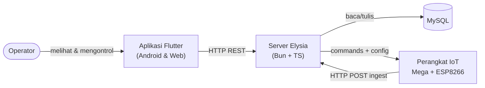
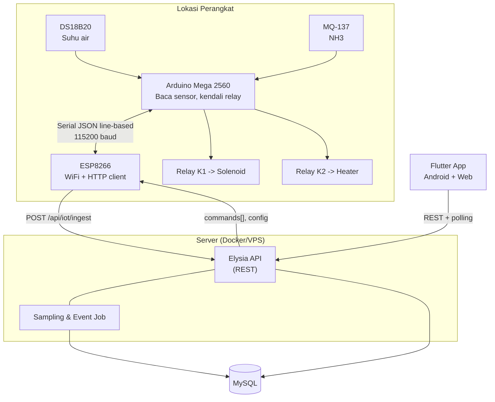

# 02 — System Architecture

## Gambaran Umum
Tiga lapisan utama: **Perangkat IoT** → **Server** → **Aplikasi**. Komunikasi
perangkat→server memakai **HTTP REST** (agar mudah disimulasikan, bisa via IP
LAN maupun domain). Aplikasi memakai HTTP REST + polling untuk live & notifikasi.

```
┌───────────────────────────┐        HTTP POST (ingest)        ┌───────────────────────────┐
│        PERANGKAT IOT       │ ───────────────────────────────▶ │          SERVER           │
│  Arduino Mega + ESP8266    │ ◀─────────────────────────────── │  Bun + TypeScript + Elysia│
│                            │   response: commands + config    │                           │
│  - DS18B20 (suhu air)      │                                  │  - REST API               │
│  - MQ-137  (gas NH3)       │                                  │  - Business logic         │
│  - Relay K1 (katup)        │                                  │  - Sampling job           │
│  - Relay K2 (heater)       │                                  │  - Event/notification     │
└───────────────────────────┘                                  └────────────┬──────────────┘
                                                                            │ SQL
                                                                            ▼
                                                                 ┌───────────────────────────┐
                                                                 │          MySQL            │
                                                                 └───────────────────────────┘
                                                                            ▲
                                                                            │ HTTP REST (polling)
                                                                 ┌──────────┴────────────────┐
                                                                 │      APLIKASI FLUTTER     │
                                                                 │   Android  +  Web         │
                                                                 │  - Dashboard              │
                                                                 │  - Grafik histori         │
                                                                 │  - Kontrol katup/heater   │
                                                                 │  - Notifikasi & pengaturan│
                                                                 └───────────────────────────┘
```

## Diagram Konteks (C4 Level 1)



## Container Diagram (C4 Level 2)



## Alur Data

### Perangkat → Server
1. Mega membaca sensor tiap 2 detik, mengirim telemetry ke ESP via Serial.
2. ESP menyimpan nilai terbaru dan mengirim `POST /api/iot/ingest` tiap
   `ingest_interval` (default 10 detik).
3. Server menyimpan ke `latest_state`, mengevaluasi logika bisnis (matang,
   suhu, safety), lalu membalas dengan daftar perintah tertunda + config
   terbaru.
4. ESP meneruskan perintah ke Mega; Mega mengeksekusi lalu mengirim ack.

### Server → Aplikasi
1. Aplikasi polling `/api/live` tiap 10 detik untuk nilai terkini.
2. Aplikasi polling `/api/events` untuk notifikasi baru.
3. Saat operator mengontrol, aplikasi `POST /api/commands`; server mengantre;
   perintah diambil ESP pada ingest berikutnya.

### Mengapa HTTP REST (bukan MQTT/WebSocket)?
- Mudah disimulasikan tanpa broker; cukup `curl`/script.
- Bisa diakses via IP LAN saat pengembangan maupun domain saat produksi.
- Perangkat di belakang NAT cukup melakukan request keluar.
- Trade-off: latensi kontrol bergantung interval ingest (diturunkan dengan
  polling cepat perangkat saat ada perintah; lihat `05-COMMUNICATION-PROTOCOL.md`).

## Komponen Server
| Komponen | Tanggung jawab |
|---|---|
| **API layer** (Elysia) | Endpoint REST, validasi, autentikasi token |
| **Service layer** | Logika bisnis: kematangan, suhu, safety, command |
| **Data layer** (Drizzle ORM) | Query & migrasi MySQL |
| **Sampling job** | Salin live → histori tiap interval |
| **Event engine** | Buat event/notifikasi & deteksi offline |

## Komponen Aplikasi Flutter
| Komponen | Tanggung jawab |
|---|---|
| **Core** | Config, theme, network client, router |
| **Features** | Dashboard, History, Control, Notifications, Settings, Device |
| **Shared** | Widget & model umum |
| **State** | Riverpod (provider/notifier + timer polling) |
| **Router** | go_router (bottom nav di mobile, rail di web) |
| **Charts** | fl_chart |

## Non-Functional & Deployment (ringkas)
- Server berjalan sebagai container (Bun) + MySQL 8, di depan reverse proxy TLS.
- Aplikasi web & Android menunjuk ke base URL server yang sama (`API_BASE_URL`).
- Kebijakan retensi data mentah dikendalikan job pemeliharaan.

Lihat detail di `06`, `07`, `08`, `11`, `12`.
