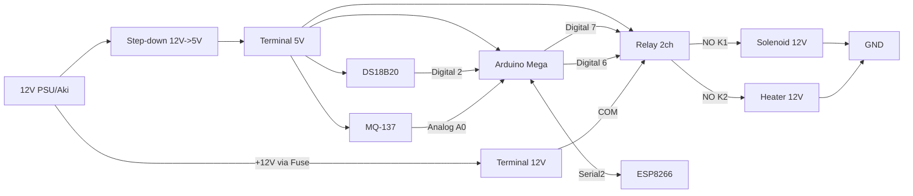

# 03 — Hardware & Wiring

## Daftar Komponen (BOM)

| # | Komponen | Spesifikasi | Jumlah | Fungsi |
|---|---|---|---|---|
| 1 | Arduino Mega 2560 R3 + ESP8266 WiFi | Board built-in IoT WiFi (ESP8266, 32MB, varian Wemos NodeMCU) | 1 | Otak sistem + koneksi WiFi |
| 2 | Sensor suhu air | DS18B20 waterproof probe (OneWire) | 1 | Mengukur suhu pupuk/cairan |
| 3 | Resistor pull-up | 4.7 kΩ | 1 | Untuk bus OneWire DS18B20 |
| 4 | Sensor gas amonia | Modul MQ-137 (NH3), output analog AOUT | 1 | Mengukur kadar gas NH3 |
| 5 | Modul relay | 2-channel, 5V, opto-isolated | 1 | Saklar katup (K1) & heater (K2) |
| 6 | Solenoid valve | 12V DC | 1 | Katup pembuangan (manual dari app) |
| 7 | Heater/pemanas | 12V DC (sesuai kebutuhan daya) | 1 | Menjaga suhu fermentasi |
| 8 | Catu daya | 12V DC (adaptor/aki) dengan arus cukup | 1 | Daya aktuator |
| 9 | Step-down | 12V → 5V, ≥ 3A | 1 | Daya logika (Mega, sensor, relay) |
| 10 | Terminal block | 2 baris (V+/GND) | 1 | Distribusi daya |
| 11 | Fuse + holder | Sesuai arus aktuator | 1 | Proteksi hubung pendek |
| 12 | Kabel & jumper | Sesuai kebutuhan | — | Koneksi |

> **Sumber daya**: desain mendukung adaptor 12V sebagai sumber utama. Opsi panel
> surya + aki (seperti dokumen lama di `reference/legacy`) tetap kompatibel:
> ganti "adaptor 12V" dengan "aki + SCC + panel surya", lalu step-down tetap
> memberi 5V ke logika.

## Peta Pin (Arduino Mega 2560)

| Fungsi | Pin Mega | Catatan |
|---|---|---|
| DS18B20 DATA | Digital 2 | OneWire + pull-up 4.7 kΩ ke 5V |
| MQ-137 AOUT | Analog A0 | Output analog (bukan D0) |
| Relay K1 (katup) | Digital 7 | Aktif HIGH (sesuaikan modul) |
| Relay K2 (heater) | Digital 6 | Aktif HIGH (sesuaikan modul) |
| Buzzer/LED status (opsional) | Digital 8 | Indikator lokal |
| Komunikasi ke ESP | Serial2 TX2(16) / RX2(17) | 115200 baud, level 3.3V↔5V |
| Daya logika 5V | 5V & GND | Dari terminal block (step-down) |

> Board "Mega + ESP8266 built-in" umumnya sudah menyediakan level shifter dan
> jalur UART antara Mega dan ESP. Verifikasi manual board masing-masing: pastikan
> Serial2 (atau jalur yang disediakan) benar-benar terhubung ke ESP, dan tidak
> bentrok dengan pin lain.

## Wiring

### 1. Daya (12V → 5V)
```
Adaptor/Aki 12V (+) ──▶ Fuse ──▶ [Terminal V+ 12V]──▶ Relay COM (K1 & K2)
Adaptor/Aki 12V (-) ──▶ GND umum ──▶ [Terminal GND]

[Teminal V+ 12V] ──▶ Step-down IN+
GND ──▶ Step-down IN-
Step-down OUT+ (5V) ──▶ [Terminal V+ 5V]
Step-down OUT- ──▶ [Terminal GND]
V+ 5V ──▶ Mega 5V, DS18B20 VCC, MQ-137 VCC, Relay VCC
GND   ──▶ Mega GND, DS18B20 GND, MQ-137 GND, Relay GND
```

### 2. Sensor Suhu (DS18B20)
```
DS18B20 VCC  (merah)  ──▶ V+ 5V
DS18B20 GND  (hitam)  ──▶ GND
DS18B20 DATA (kuning) ──▶ Mega Digital 2
Resistor 4.7 kΩ antara DATA dan V+ 5V (pull-up)
```
Saran: gunakan mode daya normal (3 kabel), bukan parasitic power.

### 3. Sensor Amonia (MQ-137)
```
MQ-137 VCC  ──▶ V+ 5V
MQ-137 GND  ──▶ GND
MQ-137 AOUT ──▶ Mega Analog A0
MQ-137 DOUT ──▶ (biarkan kosong; tidak dipakai)
```

### 4. Relay & Aktuator
```
Relay VCC ──▶ V+ 5V
Relay GND ──▶ GND
Relay IN1 ──▶ Mega Digital 7   (K1 = katup)
Relay IN2 ──▶ Mega Digital 6   (K2 = heater)

K1 (katup):
  COM ──▶ +12V (setelah fuse)
  NO  ──▶ Solenoid (+)
  Solenoid (-) ──▶ GND

K2 (heater):
  COM ──▶ +12V (setelah fuse)
  NO  ──▶ Heater (+)
  Heater (-) ──▶ GND
```
- Gunakan kontak **NO (Normally Open)** agar aktuator aman (mati) saat tidak
  diberi sinyal / listrik mati.
- Jika aktuator induktif (solenoid), tambahkan **diode flyback** di dekat beban
  untuk melindungi relay.

### 5. Komunikasi Mega ↔ ESP8266
```
Mega TX2 (16) ──▶ ESP RX
Mega RX2 (17) ◀── ESP TX
GND bersama
```
Protokol: JSON per baris (lihat `05-COMMUNICATION-PROTOCOL.md`).

## Diagram Wiring (ringkas)



## Catatan Kalibrasi & Perakitan
- MQ-137 perlu **preheat 24–48 jam** sebelum pembacaan stabil, lalu kalibrasi
  R0 di udara bersih. Rumus & prosedur ada di `04-IOT-FIRMWARE.md`.
- DS18B20: pastikan probe tercelup penuh pada media (cairan).
- Pastikan GND logika dan GND daya bertemu di satu titik (star ground) untuk
  menghindari noise pembacaan analog.
- Beri jarak antara jalur 12V dan kabel sinyal sensor.

## Referensi Lama
Dokumen wiring & flowchart proyek lama yang diarsipkan (konsep ultrasonik dan
pelepasan otomatis, **sudah tidak dipakai**) ada di:
`docs/reference/legacy/IoT_KOHE/`.
