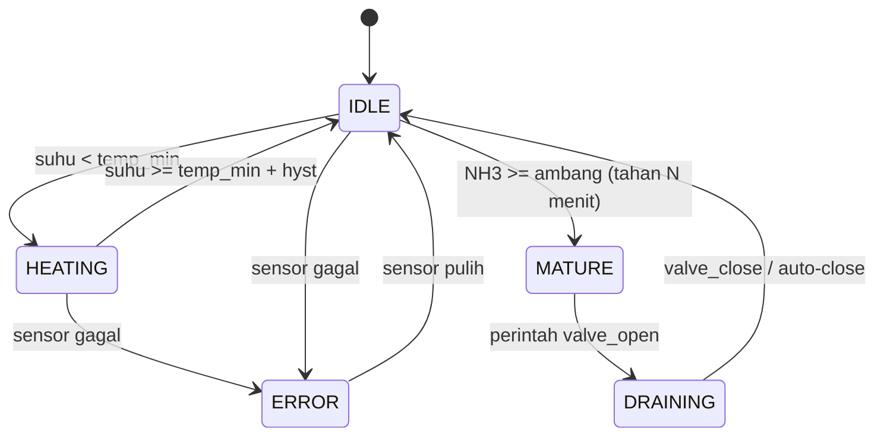

# 04 — IoT Firmware

## Pembagian Tugas
- **Arduino Mega 2560** — membaca sensor, mengendalikan relay, menjalankan logika
  suhu/heater & safety, lalu bertukar data dengan ESP8266 via Serial.
- **ESP8266** — jembatan jaringan: koneksi WiFi, HTTP client ke server,
  meneruskan perintah dari server ke Mega.

Pendekatan ini menjaga Mega tetap realtime (tidak terganggu WiFi) dan
memisahkan tanggung jawab dengan jelas.

## Struktur Kode (rencana)
```
firmware/
├── mega/
│   └── simohe_mega/
│       ├── simohe_mega.ino        # setup/loop
│       ├── config.h               # pin, konstanta, default threshold
│       ├── sensors.h/.cpp         # DS18B20, MQ-137 (Rs/R0 -> ppm)
│       ├── actuators.h/.cpp       # relay katup & heater + safety
│       ├── logic.h/.cpp           # state machine suhu/kematangan
│       └── bridge.h/.cpp          # protokol Serial ke ESP
└── esp8266/
    └── simohe_esp/
        ├── simohe_esp.ino         # WiFi + HTTP client
        ├── config.h               # WiFi, base URL, device key, interval
        └── serial_bridge.h/.cpp   # parse JSON Serial <-> HTTP payload
```

## Library
- Mega: `OneWire`, `DallasTemperature`, `ArduinoJson`.
- ESP8266: `ESP8266WiFi`, `ESP8266HTTPClient`, `ArduinoJson`.

## Sensor Suhu — DS18B20
- Bus OneWire di pin 2, pull-up 4.7 kΩ.
- Resolusi 12-bit (±0.0625 °C); baca tidak lebih dari 1×/detik.
- Bila pembacaan `-127 °C` atau `85 °C`, anggap gagal; jangan pakai nilainya.
- Terapkan filter rata-rata bergerak (mis. 5 sampel) untuk meredam noise.

## Sensor Amonia — MQ-137
1. **Preheat**: 24–48 jam (minimal 24 jam) untuk stabilitas.
2. **Baca Rs**: `Rs = RL * (Vcc - Vout) / Vout` (mis. RL = 10 kΩ, Vcc = 5V).
3. **Kalibrasi R0** di udara bersih: `R0 = Rs_clean / ratio_clean`
   (ratio_clean ≈ 3.6 untuk NH3, sesuaikan datasheet).
4. **Konversi ppm** (kurva power-law):
   `ppm = a * (Rs / R0) ^ b`
   dengan `a`, `b` dari datasheet/kurva log-log (nilai awal, wajib dikalibrasi
   di lapangan).
5. Simpan `R0` di EEPROM agar tidak kalibrasi ulang tiap boot.
6. Catat bahwa MQ-137 punya **cross-sensitivity** (gas lain bisa memengaruhi);
   nilai ppm bersifat estimasi dan harus dikalibrasi untuk kondisi nyata.

> Nilai `a`, `b`, `R0`, dan `RL` akan ditetapkan sebagai konstanta yang dapat
> disetel (`config.h` / EEPROM), bukan angka sihir di tengah kode.

## Logika Heater (di Mega)
```
mode: AUTO | FORCE_ON | FORCE_OFF (FORCE_ON punya deadline)

setiap loop:
  baca suhu
  if mode == AUTO:
     if suhu < temp_min:            heater = ON
     if suhu >= temp_min + hyst:    heater = OFF
  if mode == FORCE_ON and now < deadline: heater = ON
  if mode == FORCE_ON and now >= deadline: mode = AUTO

  # Safety (selalu menang)
  if suhu >= temp_max:             heater = OFF, kirim event SAFETY_CUTOFF
  if heater ON terus > heater_max_on_ms: heater = OFF, kirim event SAFETY_CUTOFF
```
- `temp_min` default 30 °C, `hyst` 2 °C, `temp_max` 45 °C.
- Heater tidak pernah ON saat sensor suhu gagal dibaca (fail-safe).

## Logika Kematangan (di Mega, dilaporkan ke server)
Mega menghitung estimasi ppm dan mengirimkannya. **Keputusan matang yang
otoritatif ada di server** (karena butuh durasi & histori). Mega tetap dapat
mengirim sinyal awal:
```
if nh3_ppm >= nh3_mature_ppm:
   mature_timer += dt
else:
   mature_timer = 0

if mature_timer >= mature_hold_ms: tandai "siap matang" (laporan)
```
- Katup **tidak** dibuka oleh logika ini.

## Logika Katup (di Mega)
```
katup hanya berubah karena perintah dari ESP/server:
  CMD_VALVE_OPEN  -> relay K1 = ON, mulai valve_max_open_ms timer
  CMD_VALVE_CLOSE -> relay K1 = OFF
  if katup terbuka > valve_max_open_ms: tutup paksa + event SAFETY
```

## State Machine (ringkas)



## Loop Non-Blocking
- **Tidak** memakai `delay()` panjang. Gunakan `millis()` untuk:
  - pembacaan sensor (tiap 2 detik),
  - heartbeat/telemetry ke ESP (tiap 2 detik),
  - timer heater & katup.
- Kirim telemetry ke ESP setiap 2 detik atau saat status berubah (edge-triggered).

## Konfigurasi
- Nilai default tersimpan di `config.h`.
- Konfigurasi dari server (`settings`) dikirim melalui ESP dan diterapkan Mega;
  salinan disimpan di EEPROM agar tahan restart.
- ESP memegang: SSID/password, `server_base_url`, `device_key`,
  `ingest_interval_sec`.

## Ketahanan (Resilience)
- **WiFi putus**: ESP reconnect dengan backoff eksponensial (mis. 2s, 4s, 8s…,
  maks 60s) dan menyalakan indikator.
- **Server tak terjangkau**: ESP menyimpan telemetry terakhir; kirim ulang saat
  tersambung. Buffer dibatasi (mis. 60 sampel) agar RAM aman; sampel terlama
  dibuang saat penuh.
- **Serial rusak/JSON tidak valid**: abaikan baris, jangan blok.
- **Watchdog**: aktifkan WDT pada Mega & ESP; restart bila hang.
- **Heartbeat**: ESP menyertakan uptime; server menandai perangkat offline bila
  tidak ada ingest melebihi ambang (mis. 3× interval ingest).

## Perintah (dari server ke Mega)
1. ESP menerima `commands[]` sebagai respons `POST /api/iot/ingest`.
2. ESP mengubahnya menjadi frame Serial JSON dan mengirim ke Mega.
3. Mega mengeksekusi, lalu membalas `ack` berisi `id` perintah.
4. ESP meneruskan ack ke server pada ingest berikutnya (field `acks[]`).
5. Perintah yang melewati TTL dianggap `expired` dan diabaikan.

## Pengujian Firmware
- Tahap awal tanpa hardware: uji logika lewat **device simulator**
  (`13-TESTING.md`).
- Tahap hardware: uji bench per sensor, lalu uji terintegrasi (lihat checklist
  HIL di `13-TESTING.md`).
