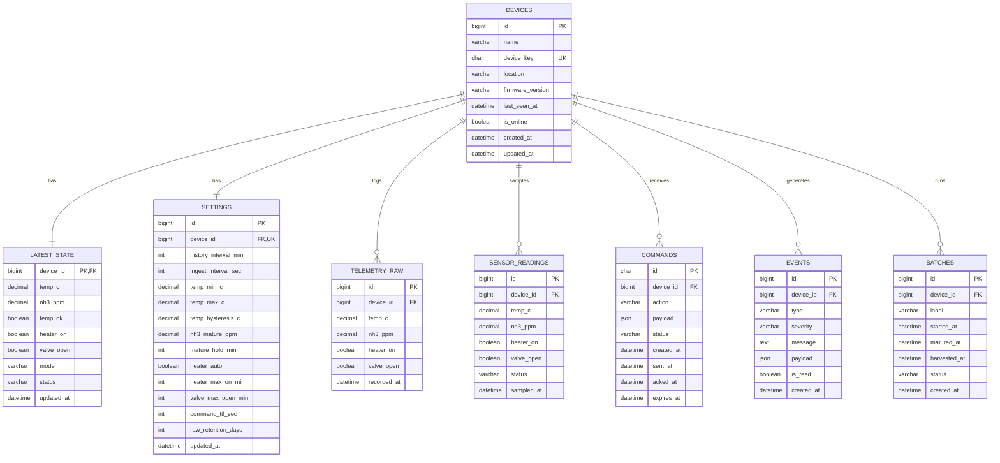

# 07 — Database Design

## DBMS
MySQL 8, charset `utf8mb4`, timezone data dalam **UTC** (`DATETIME`).

## ERD



## DDL (MySQL)

```sql
-- devices
CREATE TABLE devices (
  id               BIGINT UNSIGNED AUTO_INCREMENT PRIMARY KEY,
  name             VARCHAR(120) NOT NULL,
  device_key       CHAR(32) NOT NULL UNIQUE,
  location         VARCHAR(160) NULL,
  firmware_version VARCHAR(32) NULL,
  last_seen_at     DATETIME NULL,
  is_online        TINYINT(1) NOT NULL DEFAULT 0,
  created_at       DATETIME NOT NULL DEFAULT CURRENT_TIMESTAMP,
  updated_at       DATETIME NOT NULL DEFAULT CURRENT_TIMESTAMP ON UPDATE CURRENT_TIMESTAMP
) ENGINE=InnoDB DEFAULT CHARSET=utf8mb4;

-- latest_state (1:1 dengan device)
CREATE TABLE latest_state (
  device_id   BIGINT UNSIGNED PRIMARY KEY,
  temp_c      DECIMAL(5,2) NULL,
  nh3_ppm     DECIMAL(8,3) NULL,
  temp_ok     TINYINT(1) NOT NULL DEFAULT 1,
  heater_on   TINYINT(1) NOT NULL DEFAULT 0,
  valve_open  TINYINT(1) NOT NULL DEFAULT 0,
  mode        VARCHAR(16) NOT NULL DEFAULT 'AUTO',
  status      VARCHAR(24) NOT NULL DEFAULT 'idle',
  updated_at  DATETIME NOT NULL DEFAULT CURRENT_TIMESTAMP ON UPDATE CURRENT_TIMESTAMP,
  CONSTRAINT fk_ls_device FOREIGN KEY (device_id) REFERENCES devices(id) ON DELETE CASCADE
) ENGINE=InnoDB DEFAULT CHARSET=utf8mb4;

-- telemetry_raw (opsional, big data)
CREATE TABLE telemetry_raw (
  id          BIGINT UNSIGNED AUTO_INCREMENT PRIMARY KEY,
  device_id   BIGINT UNSIGNED NOT NULL,
  temp_c      DECIMAL(5,2) NULL,
  nh3_ppm     DECIMAL(8,3) NULL,
  heater_on   TINYINT(1) NOT NULL DEFAULT 0,
  valve_open  TINYINT(1) NOT NULL DEFAULT 0,
  recorded_at DATETIME NOT NULL,
  INDEX idx_raw_device_time (device_id, recorded_at),
  CONSTRAINT fk_raw_device FOREIGN KEY (device_id) REFERENCES devices(id) ON DELETE CASCADE
) ENGINE=InnoDB DEFAULT CHARSET=utf8mb4;

-- sensor_readings (histori tersampling)
CREATE TABLE sensor_readings (
  id          BIGINT UNSIGNED AUTO_INCREMENT PRIMARY KEY,
  device_id   BIGINT UNSIGNED NOT NULL,
  temp_c      DECIMAL(5,2) NULL,
  nh3_ppm     DECIMAL(8,3) NULL,
  heater_on   TINYINT(1) NOT NULL DEFAULT 0,
  valve_open  TINYINT(1) NOT NULL DEFAULT 0,
  status      VARCHAR(24) NOT NULL DEFAULT 'idle',
  sampled_at  DATETIME NOT NULL,
  INDEX idx_read_device_time (device_id, sampled_at),
  CONSTRAINT fk_read_device FOREIGN KEY (device_id) REFERENCES devices(id) ON DELETE CASCADE
) ENGINE=InnoDB DEFAULT CHARSET=utf8mb4;

-- settings
CREATE TABLE settings (
  id                  BIGINT UNSIGNED AUTO_INCREMENT PRIMARY KEY,
  device_id           BIGINT UNSIGNED NOT NULL UNIQUE,
  history_interval_min INT NOT NULL DEFAULT 15,
  ingest_interval_sec  INT NOT NULL DEFAULT 10,
  temp_min_c          DECIMAL(5,2) NOT NULL DEFAULT 30.00,
  temp_max_c          DECIMAL(5,2) NOT NULL DEFAULT 45.00,
  temp_hysteresis_c   DECIMAL(5,2) NOT NULL DEFAULT 2.00,
  nh3_mature_ppm      DECIMAL(8,3) NOT NULL DEFAULT 25.000,
  mature_hold_min     INT NOT NULL DEFAULT 30,
  heater_auto         TINYINT(1) NOT NULL DEFAULT 1,
  heater_max_on_min   INT NOT NULL DEFAULT 60,
  valve_max_open_min  INT NOT NULL DEFAULT 10,
  command_ttl_sec     INT NOT NULL DEFAULT 60,
  raw_retention_days  INT NOT NULL DEFAULT 30,
  updated_at          DATETIME NOT NULL DEFAULT CURRENT_TIMESTAMP ON UPDATE CURRENT_TIMESTAMP,
  CONSTRAINT fk_set_device FOREIGN KEY (device_id) REFERENCES devices(id) ON DELETE CASCADE
) ENGINE=InnoDB DEFAULT CHARSET=utf8mb4;

-- commands
CREATE TABLE commands (
  id          CHAR(36) PRIMARY KEY,
  device_id   BIGINT UNSIGNED NOT NULL,
  action      VARCHAR(24) NOT NULL,
  payload     JSON NULL,
  status      VARCHAR(16) NOT NULL DEFAULT 'pending',
  created_at  DATETIME NOT NULL DEFAULT CURRENT_TIMESTAMP,
  sent_at     DATETIME NULL,
  acked_at    DATETIME NULL,
  expires_at  DATETIME NOT NULL,
  INDEX idx_cmd_device_status (device_id, status),
  CONSTRAINT fk_cmd_device FOREIGN KEY (device_id) REFERENCES devices(id) ON DELETE CASCADE
) ENGINE=InnoDB DEFAULT CHARSET=utf8mb4;

-- events (notifikasi)
CREATE TABLE events (
  id          BIGINT UNSIGNED AUTO_INCREMENT PRIMARY KEY,
  device_id   BIGINT UNSIGNED NOT NULL,
  type        VARCHAR(32) NOT NULL,
  severity    VARCHAR(16) NOT NULL DEFAULT 'info',
  message     TEXT NOT NULL,
  payload     JSON NULL,
  is_read     TINYINT(1) NOT NULL DEFAULT 0,
  created_at  DATETIME NOT NULL DEFAULT CURRENT_TIMESTAMP,
  INDEX idx_evt_device_time (device_id, created_at),
  INDEX idx_evt_unread (is_read),
  CONSTRAINT fk_evt_device FOREIGN KEY (device_id) REFERENCES devices(id) ON DELETE CASCADE
) ENGINE=InnoDB DEFAULT CHARSET=utf8mb4;

-- batches (siklus fermentasi)
CREATE TABLE batches (
  id           BIGINT UNSIGNED AUTO_INCREMENT PRIMARY KEY,
  device_id    BIGINT UNSIGNED NOT NULL,
  label        VARCHAR(120) NULL,
  started_at   DATETIME NOT NULL,
  matured_at   DATETIME NULL,
  harvested_at DATETIME NULL,
  status       VARCHAR(16) NOT NULL DEFAULT 'fermenting',
  created_at   DATETIME NOT NULL DEFAULT CURRENT_TIMESTAMP,
  INDEX idx_batch_device (device_id, status),
  CONSTRAINT fk_batch_device FOREIGN KEY (device_id) REFERENCES devices(id) ON DELETE CASCADE
) ENGINE=InnoDB DEFAULT CHARSET=utf8mb4;
```

## Enum Logis (disimpan sebagai VARCHAR, divalidasi di aplikasi)
| Kolom | Nilai valid |
|---|---|
| `latest_state.mode` | `AUTO`, `FORCE_ON`, `FORCE_OFF` |
| `latest_state.status` | `idle`, `heating`, `mature`, `draining`, `error` |
| `commands.action` | `valve_open`, `valve_close`, `heater_on`, `heater_off`, `heater_auto` |
| `commands.status` | `pending`, `sent`, `acked`, `failed`, `expired` |
| `events.type` | `mature`, `temp_low`, `temp_high`, `heater_on`, `heater_off`, `valve_open`, `valve_close`, `device_offline`, `device_online`, `safety_cutoff` |
| `events.severity` | `info`, `warning`, `critical` |
| `batches.status` | `fermenting`, `mature`, `harvested` |

## Aturan & Indeks
- Semua kolom waktu UTC.
- Indeks komposit `(device_id, recorded_at/sampled_at)` untuk query grafik.
- `latest_state` & `settings` 1:1 dengan device.
- Hapus device → cascade ke tabel terkait.
- Nilai desimal: suhu `(5,2)`, NH3 `(8,3)`.

## Seed Awal
- 1 device dengan `device_key` acak.
- 1 baris `settings` default.
- 1 batch `fermenting` (opsional).

## Migrasi
- Dikelola `drizzle-kit` (`bun run db:generate`, `bun run db:migrate`).
- Skema sumber: `server/src/db/schema.ts`; SQL di `server/drizzle/`.
