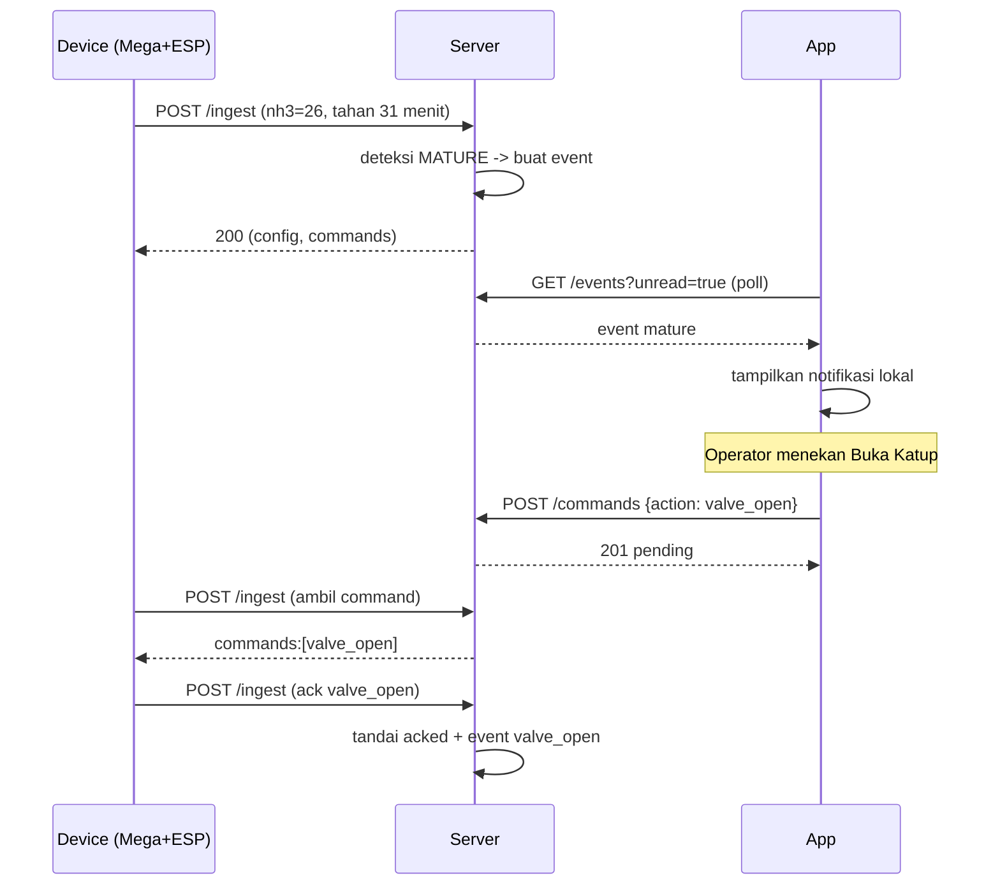

# 10 — Notifications

## Konsep
Server adalah pusat pembuat notifikasi (event engine). Aplikasi mengambil daftar
event secara berkala. Fokus utama: memberi tahu operator saat **pupuk matang**,
**suhu tidak normal**, **safety cutoff**, dan **perangkat offline**.

## Jenis Event
| Type | Severity | Pemicu | Pesan contoh |
|---|---|---|---|
| `mature` | info | NH3 ≥ ambang selama `mature_hold_min` | "Pupuk siap/matang. Buka katup dari aplikasi." |
| `temp_low` | warning | Suhu < `temp_min_c` | "Suhu rendah (27 °C). Heater menyala." |
| `temp_high` | critical | Suhu ≥ `temp_max_c` | "Suhu tinggi (46 °C)! Heater dimatikan." |
| `heater_on` | info | Heater menyala | "Heater aktif." |
| `heater_off` | info | Heater mati | "Heater nonaktif." |
| `valve_open` | info | Katup dibuka | "Katup dibuka oleh operator." |
| `valve_close` | info | Katup ditutup | "Katup ditutup." |
| `safety_cutoff` | critical | Heater max on / suhu tinggi | "Safety: heater dimatikan paksa." |
| `device_offline` | warning | Tidak ada ingest > ambang | "Perangkat tidak terhubung." |
| `device_online` | info | Ingest kembali | "Perangkat kembali online." |
| `safety_cutoff` | critical | Katup auto-close | "Katup ditutup otomatis (batas waktu)." |

## Aturan Pembuatan
- Event dibuat **sekali per transisi** (state-based), bukan setiap ingest,
  untuk mencegah spam. Contoh: `mature` dibuat sekali, bukan tiap 10 detik.
- Simpan `is_read` default `false`.
- Sertakan `payload` (nilai sensor terkait) untuk konteks.

## Materi Pesan
Setiap event menyimpan:
- `type`, `severity`, `message` (manusiawi), `payload` (JSON), `created_at`.

Contoh payload `mature`:
```json
{ "nh3_ppm": 26.1, "threshold_ppm": 25.0, "hold_minutes": 30, "batch_id": 3 }
```

## Pengiriman ke Aplikasi
### MVP (polling)
- Aplikasi polling `GET /api/events?unread=true` tiap 30–60 detik.
- Badge jumlah belum dibaca di tab Notifikasi dan ikon lonceng.

### Notifikasi Lokal (Android)
- Saat polling menemukan event baru (id lebih besar dari yang terakhir),
  tampilkan notifikasi lokal via `flutter_local_notifications`.
- Simpan `last_seen_event_id` di `shared_preferences` agar tidak dobel.

### Web
- Opsi notifikasi browser (Web Notification API) bila diizinkan.
- Minimal: badge + daftar event.

### Push Server (opsi lanjutan)
- FCM (Android) / Web Push sebagai peningkatan. Perlu registrasi token & jalur
  kredensial; didokumentasikan saat fase tersebut dikerjakan.

## Deduplikasi & Urutan
- Event diurutkan `created_at DESC`.
- Aplikasi menyimpan id terakhir yang dilihat.
- Operasi "tandai dibaca" bersifat idempotent.

## Preferensi (opsional, fase lanjutan)
- Aktif/nonaktif per jenis event.
- Ambang notifikasi (mis. hanya `warning` ke atas).

## Endpoint Terkait
```
GET  /api/events?unread=true&limit=50
POST /api/events/:id/read
POST /api/events/read-all
```

## Alur Matang (contoh lengkap)

